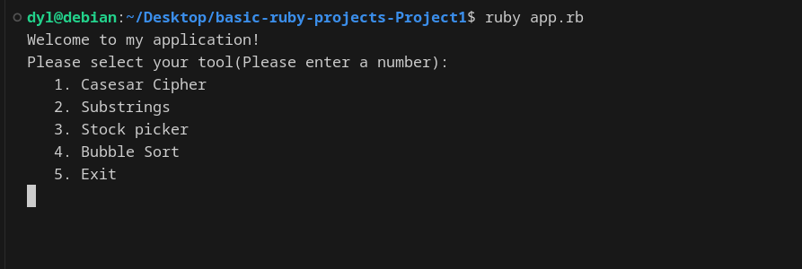

# Basic Ruby Projects

This is a command line app that completes the Caear Cipher, Sub Strings, Stock Picker, and Buuble Sort project for the Ruby path on the Odin Project.  
  
Here are the links for the projcts  
&emsp;    1. https://www.theodinproject.com/lessons/ruby-caesar-cipher  
&emsp;    2. https://www.theodinproject.com/lessons/ruby-sub-strings  
&emsp;    3. https://www.theodinproject.com/lessons/ruby-stock-picker  
&emsp;    4. https://www.theodinproject.com/lessons/ruby-bubble-sort  
In this project I will have a mini command line interface to use each tool. 
# How to run
Steps:  
&emsp;    1. download and extract the zip file from the repo  
&emsp;    2. change directories into -> basic-ruby-projects-Project1  
&emsp;    3. Use ruby app.rb  
# What I learned
This project was very useful for quickly familarizing myself with Ruby's syntax, hashmaps, loops, arrays, array functions, and conditional statements like ternary operators.
# The future
I would love to implement catches and other error handling statements. Specifally in the files that take use inputs most of them will crash if the wrong input is inputted. I would also like to create a project that uses a queue or some graph maybe the knight's travail project. 
# Dependencies  
ruby 3.3.5  
